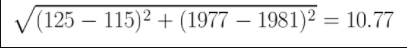
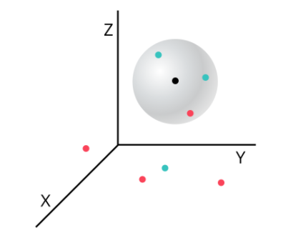
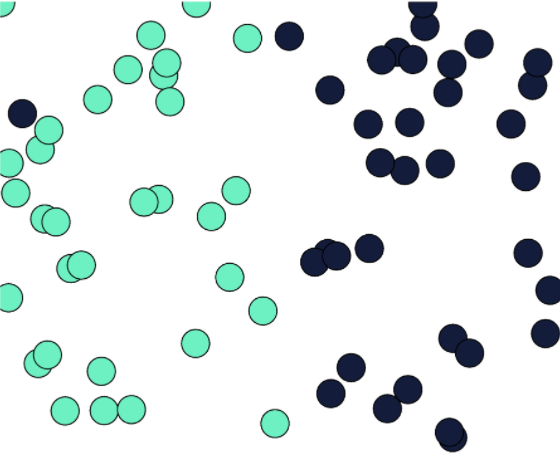

# K-Nearest Neighbors Classifier
K-Nearest Neighbors (KNN) is a classification algorithm. The central idea is that data points with similar attributes tend to fall into similar categories.

Consider the image to the right. This image is complicated, but for now, let’s just focus on where the data points are being placed. Every data point — whether its color is red, green, or white — has an x value and a y value. As a result, it can be plotted on this two-dimensional graph.

Next, let’s consider the color of the data. The color represents the class that the K-Nearest Neighbor algorithm is trying to classify. In this image, data points can either have the class green or the class red. If a data point is white, this means that it doesn’t have a class yet. The purpose of the algorithm is to classify these unknown points.

Finally, consider the expanding circle around the white point. This circle is finding the k nearest neighbors to the white point. When k = 3, the circle is fairly small. Two of the three nearest neighbors are green, and one is red. So in this case, the algorithm would classify the white point as green. However, when we increase k to 5, the circle expands, and the classification changes. Three of the nearest neighbors are red and two are green, so now the white point will be classified as red.

This is the central idea behind the K-Nearest Neighbor algorithm. If you have a dataset of points where the class of each point is known, you can take a new point with an unknown class, find it’s nearest neighbors, and classify it.


## Introduction
Before diving into the K-Nearest Neighbors algorithm, let’s first take a minute to think about an example.

Consider a dataset of movies. Let’s brainstorm some features of a movie data point. A feature is a piece of information associated with a data point. Here are some potential features of movie data points:
* the length of the movie in minutes.
* the budget of a movie in dollars.

If you think back to the previous exercise, you could imagine movies being places in that two-dimensional space based on those numeric features. There could also be some boolean features: features that are either true or false. For example, here are some potential boolean features:

* Black and white. This feature would be True for black and white movies and False otherwise.
* Directed by Stanley Kubrick. This feature would be False for almost every movie, but for the few movies that were directed by Kubrick, it would be True.

Finally, let’s think about how we might want to classify a movie. For the rest of this lesson, we’re going to be classifying movies as either good or bad. In our dataset, we’ve classified a movie as good if it had an IMDb rating of 7.0 or greater. Every “good” movie will have a class of 1, while every bad movie will have a class of 0.
## Distance Between Points - 2D
In the first exercise, we were able to visualize the dataset and estimate the k nearest neighbors of an unknown point. But a computer isn’t going to be able to do that!

We need to define what it means for two points to be close together or far apart. To do this, we’re going to use the Distance Formula.

For this example, the data has two dimensions:

* The length of the movie
* The movie’s release date
Consider Star Wars and Raiders of the Lost Ark. Star Wars is 125 minutes long and was released in 1977. Raiders of the Lost Ark is 115 minutes long and was released in 1981.

The distance between the movies is computed below:



## Distance Between Points - 3D
Making a movie rating predictor based on just the length and release date of movies is pretty limited. There are so many more interesting pieces of data about movies that we could use! So let’s add another dimension.

Let’s say this third dimension is the movie’s budget. We now have to find the distance between these two points in three dimensions.



The generalized distance formula between points A and B is as follows:

$$ \sqrt{(A_1-B_1)^2+(A_2-B_2)^2+ \dots+(A_n-B_n)^2} $$

Here, A1-B1 is the difference between the first feature of each point. An-Bn is the difference between the last feature of each point.

Using this formula, we can find the K-Nearest Neighbors of a point in N-dimensional space! We now can use as much information about our movies as we want.

We will eventually use these distances to find the nearest neighbors to an unlabeled point.

## Data with Different Scales: Normalization

When we added the dimension of budget, you might have realized there are some problems with the way our data currently looks.

Consider the two dimensions of release date and budget. The maximum difference between two movies’ release dates is about 125 years (The Lumière Brothers were making movies in the 1890s). However, the difference between two movies’ budget can be millions of dollars.

The problem is that the distance formula treats all dimensions equally, regardless of their scale. If two movies came out 70 years apart, that should be a pretty big deal. However, right now, that’s exactly equivalent to two movies that have a difference in budget of 70 dollars. The difference in one year is exactly equal to the difference in one dollar of budget. That’s absurd!

Another way of thinking about this is that the budget completely outweighs the importance of all other dimensions because it is on such a huge scale. The fact that two movies were 70 years apart is essentially meaningless compared to the difference in millions in the other dimension.

The solution to this problem is to normalize the data so every value is between 0 and 1.

## Finding the Nearest Neighbors
The K-Nearest Neighbor Algorithm:

1. Normalize the data
1. Find the k nearest neighbors
1. Classify the new point based on those neighbors

Now that our data has been normalized and we know how to find the distance between two points, we can begin classifying unknown data!

To do this, we want to find the k nearest neighbors of the unclassified point. Let’s choose a number that seems somewhat reasonable for K. Let’s choose 5.

In order to find the 5 nearest neighbors, we need to compare this new unclassified movie to every other movie in the dataset. This means we’re going to be using the distance formula again and again. We ultimately want to end up with a sorted list of distances and the movies associated with those distances.

## Count Neighbors

After finding neighbors and storing them in a list, our goal now is to count the number of good movies and bad movies in the list of neighbors. If more of the neighbors were good, then the algorithm will classify the unknown movie as good. Otherwise, it will classify it as bad.
In order to find the class of each of the labels, we’ll need to look at our movie_labels dataset. For example, movie_labels['Akira'] would give us 1 because Akira is classified as a good movie.

You may be wondering what happens if there’s a tie. What if k = 8 and four neighbors were good and four neighbors were bad? There are different strategies, but one way to break the tie would be to choose the class of the closest point.

## Choosing K
The validation accuracy changes as k changes. The first situation that will be useful to consider is when k is very small. Let’s say k = 1. We would expect the validation accuracy to be fairly low due to overfitting. Overfitting is a concept that will appear almost any time you are writing a machine learning algorithm. Overfitting occurs when you rely too heavily on your training data; you assume that data in the real world will always behave exactly like your training data. In the case of K-Nearest Neighbors, overfitting happens when you don’t consider enough neighbors. A single outlier could drastically determine the label of an unknown point. Consider the image below.



The dark blue point in the top left corner of the graph looks like a fairly significant outlier. When k = 1, all points in that general area will be classified as dark blue when it should probably be classified as green. Our classifier has relied too heavily on the small quirks in the training data.

On the other hand, if k is very large, our classifier will suffer from underfitting. Underfitting occurs when your classifier doesn’t pay enough attention to the small quirks in the training set. Imagine you have 100 points in your training set and you set k = 100. Every single unknown point will be classified in the same exact way. The distances between the points don’t matter at all! This is an extreme example, however, it demonstrates how the classifier can lose understanding of the training data if k is too big.

## Using sklearn

Python’s sklearn library. sklearn is a Python library specifically used for Machine Learning. It has an amazing number of features, but for now, we’re only going to investigate its K-Nearest Neighbor classifier.

There are a couple of steps we’ll need to go through in order to use the library. First, you need to create a KNeighborsClassifier object. This object takes one parameter - k. For example, the code below will create a classifier where k = 3
```python
classifier = KNeighborsClassifier(n_neighbors = 3)
```
Next, we’ll need to train our classifier. The .fit() method takes two parameters. The first is a list of points, and the second is the labels associated with those points. So for our movie example, we might have something like this
```python
training_points = [
  [0.5, 0.2, 0.1],
  [0.9, 0.7, 0.3],
  [0.4, 0.5, 0.7]
]

training_labels = [0, 1, 1]
classifier.fit(training_points, training_labels)
```
Finally, after training the model, we can classify new points. The .predict() method takes a list of points that you want to classify. It returns a list of its guesses for those points.
```python
unknown_points = [
  [0.2, 0.1, 0.7],
  [0.4, 0.7, 0.6],
  [0.5, 0.8, 0.1]
]
 
guesses = classifier.predict(unknown_points)
```

## Regression
The K-Nearest Neighbors algorithm is a powerful supervised machine learning algorithm typically used for classification. However, it can also perform regression.

In this lesson, we will use the movie dataset that was used in the K-Nearest Neighbors classifier lesson. However, instead of classifying a new movie as either good or bad, we are now going to predict its IMDb rating as a real number.

This process is almost identical to classification, except for the final step. Once again, we are going to find the k nearest neighbors of the new movie by using the distance formula. However, instead of counting the number of good and bad neighbors, the regressor averages their IMDb ratings.

For example, if the three nearest neighbors to an unrated movie have ratings of 5.0, 9.2, and 6.8, then we could predict that this new movie will have a rating of 7.0.