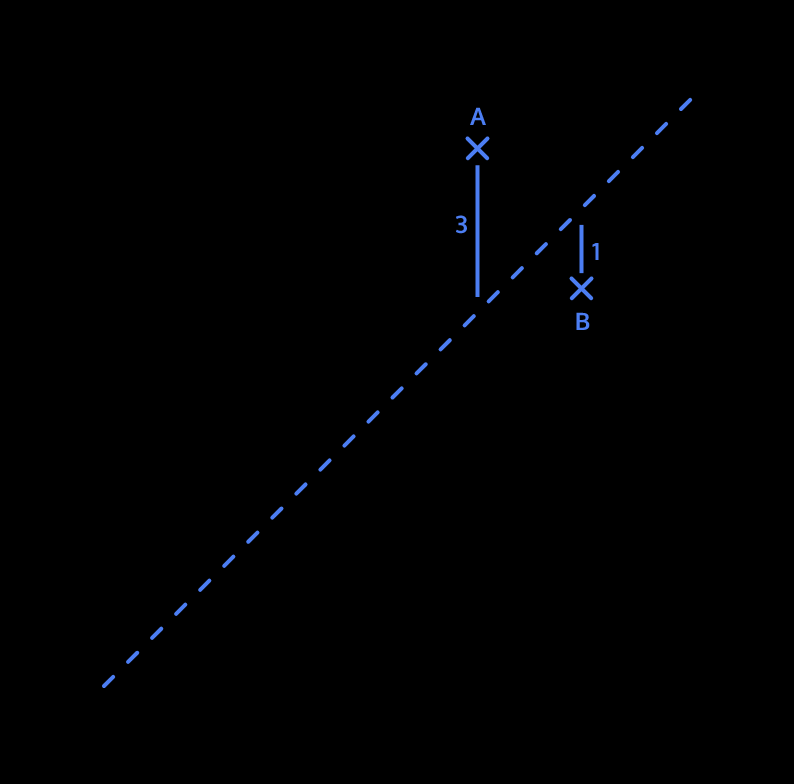
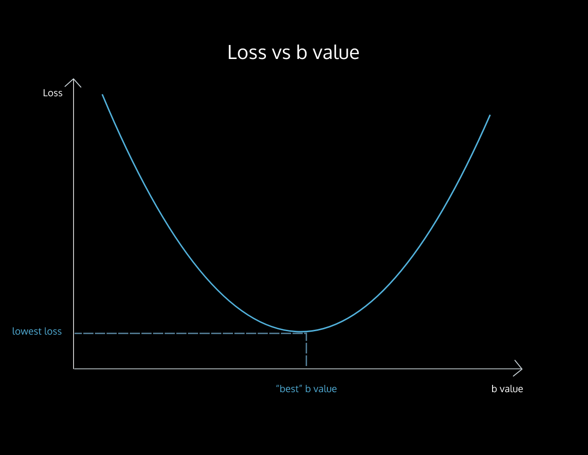
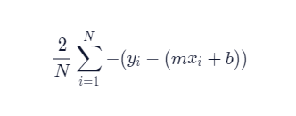
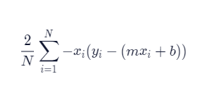
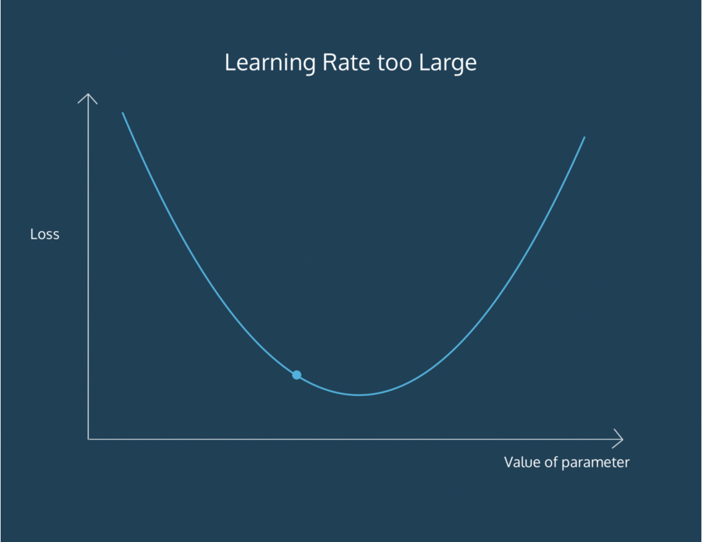

# Linear Regression 
--- 
---
The simplest model that we can fit to data is a line. When we are trying to find a line that fits a set of data best, we are performing Linear Regression.

We often want to find lines to fit data, so that we can predict unknowns. For example:

* The market price of a house vs. the square footage of a house. Can we predict how much a house will sell for, given its size?
  
* The tax rate of a country vs. its GDP. Can we predict taxation based on a country’s GDP?
  
* The amount of chips left in the bag vs. number of chips taken. Can we predict how much longer this bag of chips will last, given how much people at this party have been eating?

`Formula for line is Y = MX + B`

When we think about how we can assign a slope and intercept to fit a set of points, we have to define what the best fit is.

For each data point, we calculate loss, a number that measures how bad the model’s (in this case, the line’s) prediction was. You may have seen this being referred to as error.

We can think about loss as the squared distance from the point to the line. We do the squared distance (instead of just the distance) so that points above and below the line both contribute to total loss in the same way:

 

* For point A, the squared distance is 9
* For point B, the squared distance is 1
So the Total Loss = 10

> The goal of a linear regression model is to find the slope and intercept pair that minimizes loss on average across all of the data..
As we try to minimize loss, we take each parameter we are changing, and move it as long as we are decreasing loss. It’s like we are moving down a hill, and stop once we reach the bottom:

 

The process by which we do this is called gradient descent. We move in the direction that decreases our loss the most. Gradient refers to the slope of the curve at any point. 
Formula for Gradient Descent is: - 



It can be derived using Calculus
* N is the number of points we have in our dataset
* m is the current gradient guess
* b is the current intercept guess
Basically:

* we find the sum of y_value - (m*x_value + b) for all the y_values and x_values we have
  and then we multiply the sum by a factor of -2/N. N is the number of points we have.

Gradient Descent for Slope
We have a function to find the gradient of b at every point. To find the m gradient, or the way the loss changes as the slope of our line changes, we can use this formula:



Once more:

* N is the number of points you have in your dataset 
* m is the current gradient guess
* b is the current intercept guess
To find the m gradient:

* we find the sum of x_value * (y_value - (m*x_value + b)) for all the y_values and x_values we have
  and then we multiply the sum by a factor of -2/N. N is the number of points we have.

Once we have a way to calculate both the m gradient and the b gradient, we’ll be able to follow both of those gradients downwards to the point of lowest loss for both the m value and the b value. Then, we’ll have the best m and the best b to fit our data!

Now that we know how to calculate the gradient, we want to take a “step” in that direction. However, it’s important to think about whether that step is too big or too small. We don’t want to overshoot the minimum error!

We can scale the size of the step by multiplying the gradient by a learning rate.

To find a new b value, we would say:

```python
new_b = current_b - (learning_rate * b_gradient)
```
where current_b is our guess for what the b value is, b_gradient is the gradient of the loss curve at our current guess, and learning_rate is proportional to the size of the step we want to take.
 
How do we know when we should stop changing the parameters m and b? How will we know when our program has learned enough?

To answer this, we have to define convergence. Convergence is when the loss stops changing (or changes very slowly) when parameters are changed.

## Learning Rate 
We want our program to be able to iteratively learn what the best m and b values are. So for each m and b pair that we guess, we want to move them in the direction of the gradients we’ve calculated. But how far do we move in that direction?

We have to choose a learning rate, which will determine how far down the loss curve we go.

A small learning rate will take a long time to converge — you might run out of time or cycles before getting an answer. A large learning rate might skip over the best value. It might never converge!



