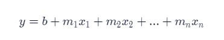
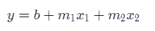
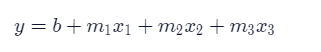
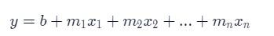
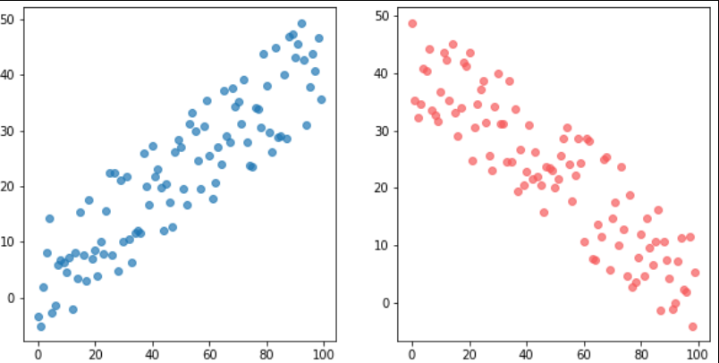

# MULTIPLE LINEAR REGRESSION 
## Introduction to Multiple Linear Regression
Linear regression is useful when we want to predict the values of a variable from its relationship with other variables. There are two different types of linear regression models (simple linear regression and multiple linear regression).

In predicting the price of a home, one factor to consider is the size of the home. The relationship between those two variables, price and size, is important, but there are other variables that factor in to pricing a home: location, air quality, demographics, parking, and more. When making predictions for price, our dependent variable, we’ll want to use multiple independent variables. To do this, we’ll use Multiple Linear Regression.

Multiple Linear Regression uses two or more independent variables to predict the values of the dependent variable. It is based on the following equation that we’ll explore later on: 

## Training Set vs. Test Set
As with most machine learning algorithms, we have to split our dataset into:

* Training set: the data used to fit the model
* Test set: the data partitioned away at the very start of the experiment (to provide an unbiased evaluation of the model)

In general, putting 80% of your data in the training set and 20% of your data in the test set is a good place to start.
Suppose you have some values in x and some values in y:

```python

from sklearn.model_selection import train_test_split
 
x_train, x_test, y_train, y_test = train_test_split(x, y, train_size=0.8, test_size=0.2)
```
where 
* train_size: the proportion of the dataset to include in the train split (between 0.0 and 1.0)
* test_size: the proportion of the dataset to include in the test split (between 0.0 and 1.0)
* random_state: the seed used by the random number generator [optional]

are the parameters

## Multiple Linear Regression: Scikit-Learn
Now we have the training set and the test set, let’s use scikit-learn to build the linear regression model!

The steps for multiple linear regression in scikit-learn are identical to the steps for simple linear regression. Just like simple linear regression, we need to import LinearRegression from the linear_model module:
```python
from sklearn.linear_model import LinearRegression
```

Then, create a LinearRegression model, and then fit it to your x_train and y_train data and
We can also use the .predict() function to pass in x-values. It returns the y-values that this plane would predict:
```python
mlr = LinearRegression()
 
mlr.fit(x_train, y_train) 
# finds the coefficients and the intercept value
y_predicted = mlr.predict(x_test)
# takes values calculated by `.fit()` and the `x` values, plugs them into the multiple linear regression equation, and calculates the predicted y values. 
```

## Visualizing Results with Matplotlib
### How do you create 2D graphs?
Graphs can be created using Matplotlib’s pyplot module. Here is the code with inline comments explaining how to plot using Matplotlib’s .scatter():

```python
# Create a scatter plot
plt.scatter(x, y, alpha=0.4)
 
# Create x-axis label and y-axis label
plt.xlabel("the x-axis label")
plt.ylabel("the y-axis label")
 
# Create a title
plt.title("title!")
 
# Show the plot
plt.show()
```
We want to create a scatterplot like this: 


## Multiple Linear Regression Equation
Now that we have implemented Multiple Linear Regression, we will learn how to tune and evaluate the model. Before we do that, however, it’s essential to learn the equation behind it.

Equation 6.1 The equation for multiple linear regression that uses two independent variables is this:

Equation 6.2 The equation for multiple linear regression that uses three independent variables is this:

Equation 6.3 As a result, since multiple linear regression can use any number of independent variables, its general equation becomes:

Here, m1, m2, m3, … mn refer to the coefficients, and b refers to the intercept that you want to find. You can plug these values back into the equation to compute the predicted y values.
Remember, with sklearn‘s LinearRegression() method, we can get these values with ease.

The .fit() method gives the model two variables that are useful to us:

* .coef_, which contains the coefficients
* .intercept_, which contains the intercept
After performing multiple linear regression, you can print the coefficients using .coef_.

## Interpreting graphs

In regression, the independent variables will either have a positive linear relationship to the dependent variable, a negative linear relationship, or no relationship. A negative linear relationship means that as X values increase, Y values will decrease. Similarly, a positive linear relationship means that as X values increase, Y values will also increase.
Graphically, when you see a downward trend, it means a negative linear relationship exists. When you find an upward trend, it indicates a positive linear relationship. Here are two graphs indicating positive and negative linear relationships:


## Evaluating the Model's Accuracy
When trying to evaluate the accuracy of our multiple linear regression model, one technique we can use is Residual Analysis.

The difference between the actual value y, and the predicted value ŷ is the residual e. The equation is:

$$ e = y - \hat{y} $$

In the StreetEasy dataset, y is the actual rent and the ŷ is the predicted rent. The real y values should be pretty close to these predicted y values.

sklearn‘s linear_model.LinearRegression comes with a .score() method that returns the coefficient of determination R² of the prediction.

The coefficient R² is defined as:

$$ 1 - \frac{u}{v} $$
​ 
where u is the residual sum of squares:

```python
((y - y_predict) ** 2).sum()
```
and v is the total sum of squares (TSS):
```python
((y - y.mean()) ** 2).sum()
```
The TSS tells you how much variation there is in the y variable.

R² is the percentage variation in y explained by all the x variables together.

For example, say we are trying to predict rent based on the size_sqft and the bedrooms in the apartment and the R² for our model is 0.72 — that means that all the x variables (square feet and number of bedrooms) together explain 72% variation in y (rent).

Now let’s say we add another x variable, building’s age, to our model. By adding this third relevant x variable, the R² is expected to go up. Let say the new R² is 0.95. This means that square feet, number of bedrooms and age of the building together explain 95% of the variation in the rent.

The best possible R² is 1.00 (and it can be negative because the model can be arbitrarily worse). Usually, a R² of 0.70 is considered good.
